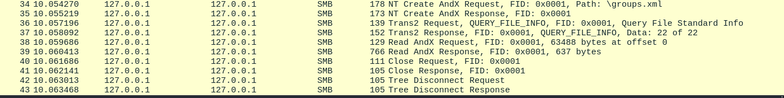
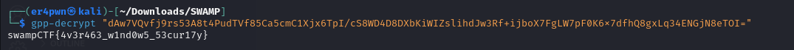

# Preferential Treatment - Swamp CTF

## Category: Forensics

### Description
An old Windows Server 2008 instance was provided, and the password had been lost. A packet capture file, `gpnightmare.pcap`, was given for analysis to recover the credentials.

### Analysis
Opening the packet capture in Wireshark, an interesting XML file was found within SMB traffic.



Extracting the file revealed the following content:

```xml
<?xml version="1.0" encoding="utf-8"?>
<Groups clsid="{3125E937-EC16-4b4c-9934-544FC6D24D26}">
    <User clsid="{DF5F1855-52E5-4d24-8B1A-D9BDE98BA1D1}" name="swampctf.com\Administrator" image="2"
          changed="2018-07-18 20:46:06" uid="{EF57DA28-5F69-4530-A59E-AAB58578219D}">
        <Properties action="U" newName="" fullName="" description=""
                    cpassword="dAw7VQvfj9rs53A8t4PudTVf85Ca5cmC1Xjx6TpI/cS8WD4D8DXbKiWIZslihdJw3Rf+ijboX7FgLW7pF0K6x7dfhQ8gxLq34ENGjN8eTOI="
                    changeLogon="0" noChange="1" neverExpires="1" acctDisabled="0" userName="swampctf.com\Administrator"/>
    </User>
</Groups>
```

The `cpassword` field indicated that this was an encrypted password stored in Group Policy Preferences (GPP) files. These were previously used in Windows environments but were insecure due to Microsoft using a fixed encryption key, which was later publicly disclosed.

### Exploitation
Using `gpp-decrypt`, the encrypted password was decrypted:

```sh
gpp-decrypt "dAw7VQvfj9rs53A8t4PudTVf85Ca5cmC1Xjx6TpI/cS8WD4D8DXbKiWIZslihdJw3Rf+ijboX7FgLW7pF0K6x7dfhQ8gxLq34ENGjN8eTOI="
```

This revealed the flag:

```
swampCTF{4v3r463_w1nd0w5_53cur17y}
```



