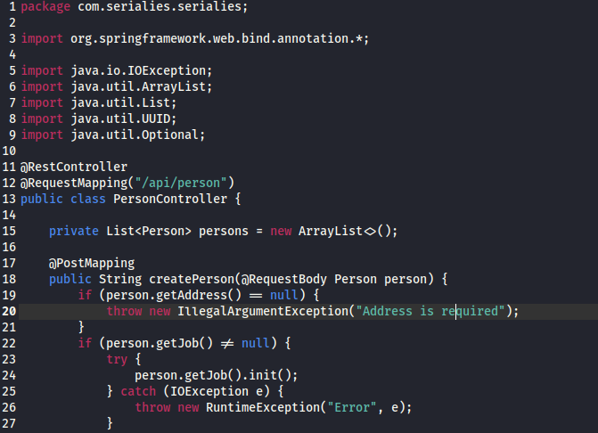
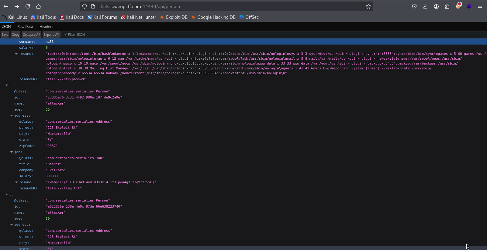

# Serialies - Web Exploitation (SwampCTF)


## Category: Web  

We were given a file named `serialies.zip`. Extracting the file revealed a `src` folder containing `main/` and `test/` subdirectories. Inside the `main` folder, we found Java source code files.  

By examining the file **`src/main/java/com/serialies/serialies/PersonController.java`**, we discovered an interesting API endpoint:  

  

```
/api/person
```

Navigating to the endpoint in a browser:

🔗 **URL:** [http://chals.swampctf.com:44444/api/person](http://chals.swampctf.com:44444/api/person)  

The flag was directly visible in the JSON response. 

  

 **Flag:** `swampCTF{f1l3_r34d_4nd_d3s3r14l1z3_pwn4g3_x7q9z2r5v8}`  
